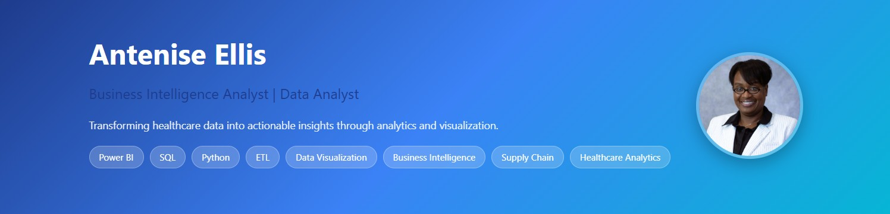

## 👋 About Me
Data professional transitioning to Business Intelligence through self-directed mastery of Power BI, SQL, and Python. I build executive-ready dashboards and analytical solutions for healthcare operations and supply chain optimization—delivering actionable insights that drive strategic decision-making and measurable business value.

## 🛠️ Technical Skills

**Data Analysis & Visualization:**
- Power BI (Advanced DAX, Power Query, Dashboard Development)
- Tableau
- Microsoft Excel (Pivot Tables, VLOOKUP, XLOOKUP, Advanced Analytics)
- Data Modeling & Storytelling

**Programming & Databases:**
- SQL (MS SQL Server, MySQL)
- Python (pandas, NumPy, matplotlib, seaborn)
- Predictive Modeling

**Business Intelligence:**
- ETL Processes & Data Transformation
- API Integration
- KPI Development
- Process Automation

**Additional Tools:**
- Salesforce, SAP, Git/GitHub
- Statistical Analysis
- Stakeholder Communication

## 📊 Featured Projects

### 🏥 [GPO Membership & Contract Analytics Dashboard](https://github.com/aj6567/NashvilleHousingData-PP)
**Tools:** Python (pandas, NumPy), Power BI, Power Query, DAX, SQL  
Built interactive dashboard tracking 2,500+ GPO members and contract performance metrics. Identified regions with lowest contract adoption rates, enabling targeted intervention strategies. Automated data refresh processes for repeatable, accurate reporting.

**Key Results:**
- Tracked membership growth and contract adoption rates
- Measured cost savings and vendor performance
- Enabled data-driven resource allocation decisions

### 💊 [Oncology Drug Utilization & Patient Outcomes Dashboard](https://github.com/aj6567/PortfolioProjects)
**Tools:** Python (pandas, NumPy), Matplotlib, Seaborn, Power BI, DAX  
Analyzed 5,000+ patient treatment records revealing targeted therapies achieved 62% improvement rates. Identified regional treatment disparities and seasonal demand patterns to inform resource allocation.

**Key Results:**
- Revealed 15% year-over-year growth in immunotherapy
- Identified March and September demand peaks
- Optimized drug formularies and reduced treatment costs

### 📦 [Pharmaceutical Supply Chain Risk & Inventory Optimization](https://github.com/aj6567/PortfolioProjects)
**Tools:** Python (pandas, NumPy), Power BI, Predictive Modeling, SQL  
Created executive dashboard providing visibility into inventory risk, delayed shipments, and forecasted shortages. Applied predictive modeling to identify high-risk suppliers and prevent stockouts.

**Key Results:**
- Forecasted potential stockouts proactively
- Identified high-risk suppliers for intervention
- Automated workflows improving decision-making speed

## 💼 Professional Experience

**Customer Service Representative** - McKesson | Fort Worth, TX | May 2025 - Present  
Supporting pharmaceutical solutions operations with data tracking, order processing, and cross-functional collaboration.

**Previous roles include:** Mortgage Loan Originator, Export Customer Service Representative (CMA-CGM), Bankruptcy Specialist (GM Financial)

## 🎓 Education & Certifications

- **Microsoft Power BI Data Analyst Certification** - Coursera | November 2025
- **Data Analytics Bootcamp** - Alex the Analyst | 2025
- **Associate of Applied Science** - Tarrant County College

## 📫 Let's Connect

- 💼 [LinkedIn](https://linkedin.com/in/antenise-ellis-data-analyst)
- 📧 anteniseellis@gmail.com
- 📱 (682) 403-2286
- 🌐 [Portfolio](https://aj6567.github.io/anteniseellis/)

---
⭐ **Specialties:** Healthcare Analytics | Supply Chain Optimization | Executive Dashboards | Process Automation
